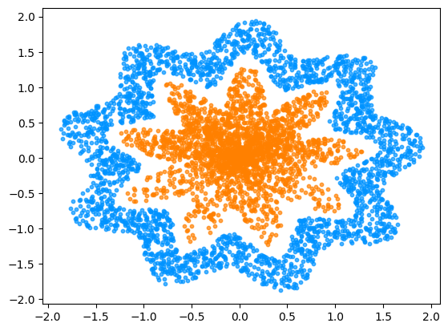

# Semestre 1 - Checkpoint 02 - Redes Neurais

Projeto desenvolvido para avaliação da disciplina Disruptive Architectures - IOT, IOB AND IA. O conteúdo que se segue nesse README foi escrito baseado no projeto e nas instruções do professor.

    

### Resumo

Foi-nos fornecido um algoritmo que gera, baseado no RM do aluno, dois conjuntos de dados aleatórios. A quantidade de linhas varia e depende da soma dos números do códico de identificação do aluno.

O objetivo do projeto se resume a criar um modelo de rede neural que consiga predizer a qual conjunto de dados um valor pertence. Naturalmente, percebi que o problema pode ser resolvido com uma predição binaria: pertence ou não pertence.

## Instruções do professor

- Avaliação **INDIVIDUAL**;
- **Objetivo:**
Avaliar conceitos sobre Aprendizado Profundo com Redes Neurais;
- **Descrição do Projeto:**
Implemente uma rede neural que seja capaz de classificar corretamente os dados;
- Comente sobre a decisão de cada parametro utilizado;
- **Serão avaliados:**
    - Estrutura do código;
    - Testes realizados;
    - Números de neurônios;
    - Número de camadas;
    - Algoritmo de adaptação;
    - Parâmetros do algoritmo de adaptação;
    - Função de ativação.
- Cuidado com a desonestidade intelectual (auto avaliação sincera no formulário; plágio; cola de trabalhos);
- O estudante deve:
    - implementar o projeto baseado na rubrica apresentada;
    - preencher o google forms de avaliação disponibilizado pelo professor;
    - subir o código em um repositório do github.
    
## Autor
Feito por [@fernandogong](https://github.com/fernandogong).

LinkedIn: [Fernando Gong](https://www.linkedin.com/in/fernando-gong/)  
Email: [fernand0cg0ng@gmail.com](mailto:fernand0cg0ng@gmail.com)
